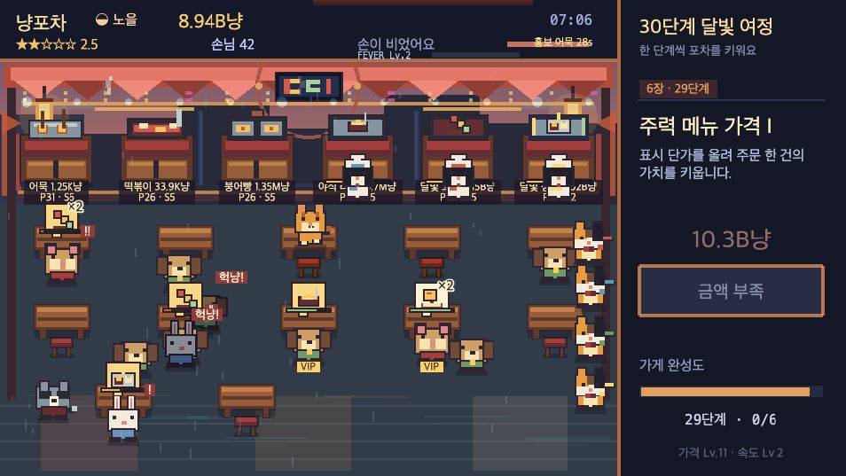
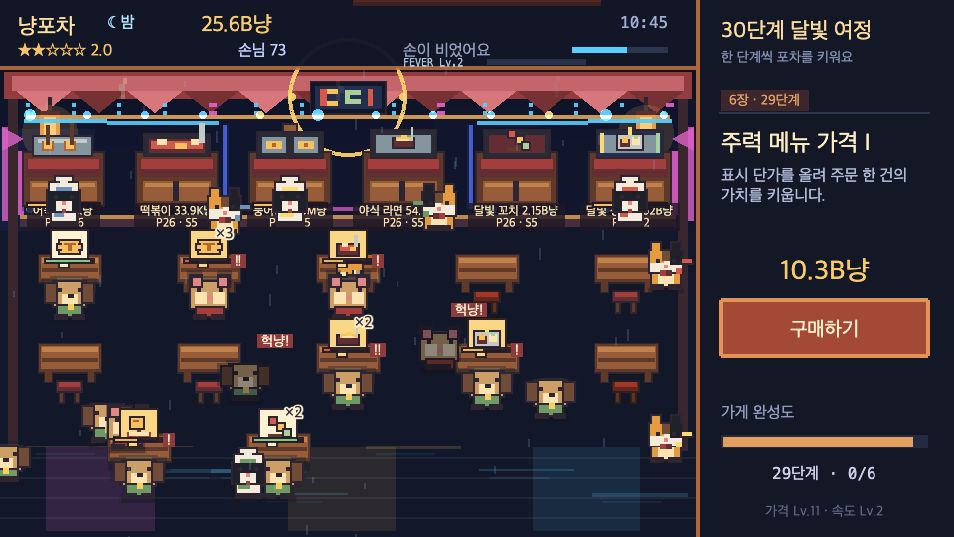

# Meow Night Diner

> A cozy pixel-art restaurant management journey where a cat owner builds five themed restaurants across 150 increasingly demanding stages.

## Play the Game

[Play Meow Night Diner in your browser](https://junn0s.github.io/Meow/)

The game runs directly in a modern desktop or mobile browser and can also be installed as a PWA.

### Install on a Phone

- iPhone or iPad: open the game in Safari, tap **Share**, choose **Add to Home Screen**, enable **Open as Web App**, and tap **Add**.
- Android: open the game in Chrome, open the browser menu, then choose **Install app** or **Add to Home screen**.

The installed game launches in a standalone window. Its core game files and menu music remain available offline after the first successful load; gameplay tracks continue to stream so mobile browsers can use efficient range requests.

## Gameplay

### Sunset



Warm sunset colors fill the stall before the blue neon lights take over.

### Night



At night, neon signs, rain reflections, and cool blue lighting transform the diner.

## About the Game

Serve customers, cook and deliver their orders, then reinvest the earnings in food prices, cooking speed, seats, chefs, servers, fever bonuses, and the diner itself. The early stages teach the core loop quickly, while later stages introduce larger orders, VIP customers, rush periods, and increasingly expensive upgrades.

Key features include:

- Five 30-stage chapters: a moonlit street-food stall, beach cocktail bar, Korean restaurant, classic restaurant, and omakase counter
- 30 theme-specific dishes with separate price and cooking-speed upgrades
- Expandable seating and automatic chef and server workers with same-dish parallel cooking
- A persistent owner-cat color shop with purchasable and equipable styles
- Persistent facility upgrades for cooking speed, patience, seating, revenue, and decor
- Day, sunset, night, and dawn transitions during active play
- Phase-aware lo-fi playlists for the menu, day, sunset, night, and dawn
- Fever time, menu promotions, customer rushes, combos, tips, and VIP bonuses
- Six fame tiers that expand the diner visuals and add up to a 10% revenue bonus
- Local save data and capped offline earnings
- Keyboard, mouse, and mobile touch controls

## Controls

### Desktop

| Action | Control |
| --- | --- |
| Move the owner cat | `WASD` or arrow keys |
| Take an order, start cooking at its worktop, pick up food, or serve | `Space` |
| Pause or open settings | `Esc` |
| Save immediately | Open settings, then select `지금 저장` |
| Toggle sound effects | `M` |
| Use menus and buy upgrades | Mouse click |

### Mobile

| Action | Control |
| --- | --- |
| Move the owner cat | Drag the on-screen analog joystick, including diagonally |
| Take an order, start cooking at its worktop, pick up food, or serve | Tap the round action button |
| Pause or open settings | Tap the pause button |
| Save immediately | Open settings, then tap `지금 저장` |
| Use menus and buy upgrades | Tap the desired button |

In portrait mode, the gameplay area is centered vertically and the progression purchase card moves below the diner instead of occupying its right side. Pinch zoom, double-tap zoom, text selection, and long-press callouts are disabled on the game surface.

Orders taken by the owner wait at their matching worktop until the owner starts cooking them. The owner has one manual cooking slot separate from the hired chefs, so the owner can cook fishcake while a chef prepares tteokbokki. Each server independently delivers a ready dish to any compatible waiting customer.

Same-dish chef concurrency is `min(hired chefs, that dish's worktop slots)`. With three chefs and a two-slot fishcake worktop, two chefs cook fishcake simultaneously while the third chef can prepare another dish. Active worktops show `조리×2` or `조리×3`, and completed servings stack as separate ready dishes. Worktop labels expose only the dish name and current sale price; internal price, speed, and slot levels stay hidden.

Chefs and servers walk at the same base speed as the owner cat. After a delivery, servers remain at the handoff location instead of returning to a right-side lineup.

## Source Directory

```text
src/
├── main.ts                 # Phaser bootstrap and browser control bindings
├── styles.css              # Responsive page layout and mobile touch UI
├── pwa/                    # Installability and service-worker registration
├── debug.d.ts              # Types for the optional browser debug API
├── vite-env.d.ts           # Vite environment type declarations
├── game/
│   ├── art/                # Pixel textures, decor, atmosphere, and presentation
│   ├── audio/              # Sound effects and day/night ambience
│   ├── data/               # Menu, customer, progression, upgrade, and visual data
│   ├── economy/            # Currency formatting and economy calculations
│   ├── entities/           # Player, customers, tables, and cooking stations
│   ├── input/              # Pointer and touch input state management
│   ├── scenes/             # Boot, menu, gameplay, and result scenes
│   ├── systems/            # Progression, saves, service flow, upgrades, and time
│   └── types/              # Shared game state and TypeScript contracts
└── ui/                     # HUD, buttons, toast messages, and upgrade panel
```

### Main Modules

| Path | Responsibility |
| --- | --- |
| `src/game/scenes/GameScene.ts` | Runs the restaurant loop, customers, workers, interactions, rushes, and payments. |
| `src/game/data/chapterData.ts` | Defines all five restaurants, menus, finale objects, colors, and economy scales. |
| `src/game/data/progressionData.ts` | Defines each chapter's 30-stage progression curve and worker unlocks. |
| `src/game/systems/ProgressionSystem.ts` | Applies purchases, chapter resets, menu levels, fever progression, and completion rules. |
| `src/game/systems/ServiceFlowRules.ts` | Controls customer capacity, arrival flow, and valid food recipients. |
| `src/game/systems/CookingFlowRules.ts` | Enforces kitchen slot capacity and one simultaneous task per chef. |
| `src/game/systems/DayNightController.ts` | Advances the active-play clock through day, sunset, night, and dawn. |
| `src/game/input/TouchControls.ts` | Converts the mobile drag joystick into continuous diagonal movement and handles touch actions. |
| `src/ui/MobileUpgradePanel.ts` | Mirrors progression purchases below the portrait gameplay area. |
| `src/ui/UpgradePanel.ts` | Displays the current progression goal and handles upgrade purchases. |

## Run Locally

Node.js 20 or newer is recommended.

```bash
npm install
npm run dev
```

Open the local URL printed by Vite in your browser.

## Production Checks

```bash
npm run typecheck
npm run test:foundation
npm run simulate:balance
npm run build
npm run test:release
```

The production client is generated in `dist/client`. GitHub Pages deployment is configured through the repository workflow, and Vite uses a relative base path so assets work under the repository URL.

## Additional Documentation

- [30-Stage Economy, Balance, and Design Specification](docs/30-stage-economy-balance-design.md)
- [Game Description](docs/game-description.md)
- [AI Usage Report](docs/ai-usage-report.md)
- [Assets and Licenses](docs/asset-licenses.md)

All pixel textures are generated with Phaser Graphics, while short sound effects and room tone are synthesized with the Web Audio API. The lo-fi background playlist is stored as optimized Opus audio; attribution and asset notes are documented in [Assets and Licenses](docs/asset-licenses.md).
